# HiTeckKart — Full Stack Ecommerce on AWS

A full stack ecommerce web application built with **React + Spring Boot**, deployed on AWS following cloud best practices — private networking, auto scaling, secure access, and CDN delivery.

> **Live URL:** https://dx477fyqoy1pm.cloudfront.net

---

## Application Screenshots

| Home | Add Product | Categories |
|------|-------------|------------|
| 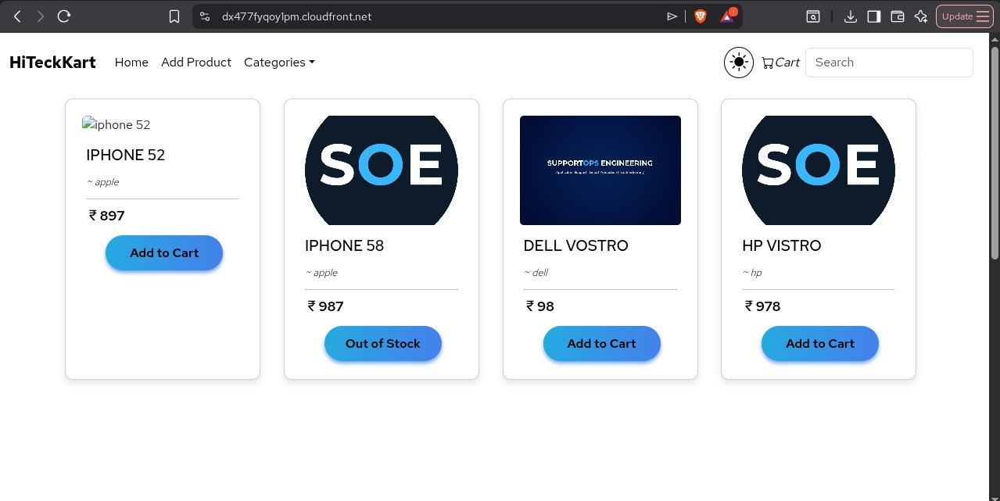 | 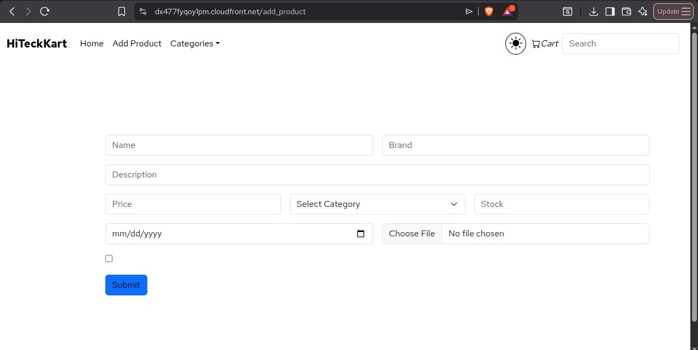 | 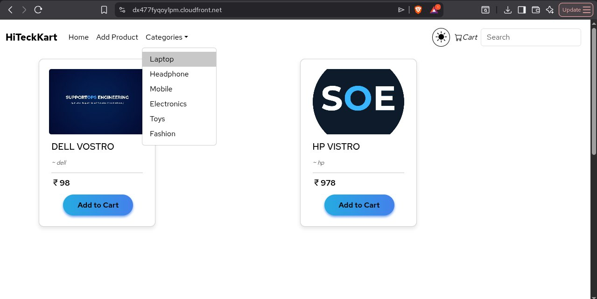 |

| Update Product | Delete Product | Cart |
|----------------|---------------|------|
| 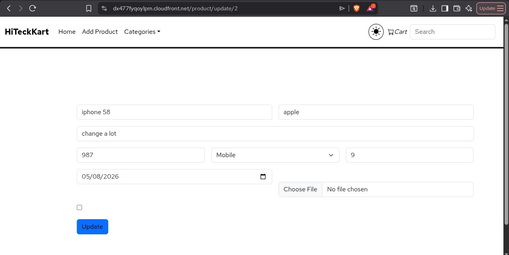 | 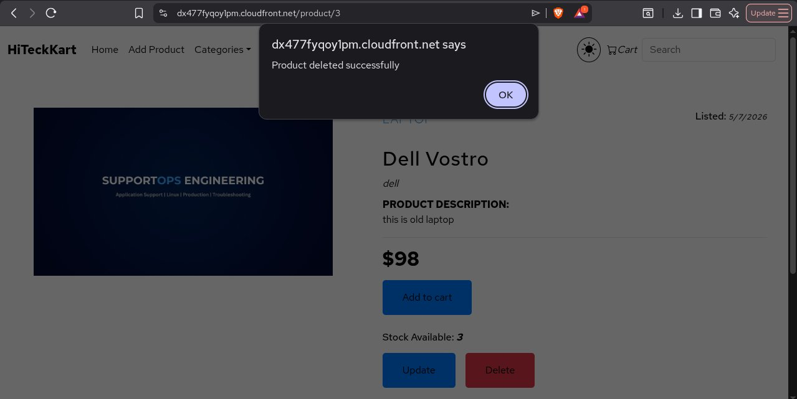 | 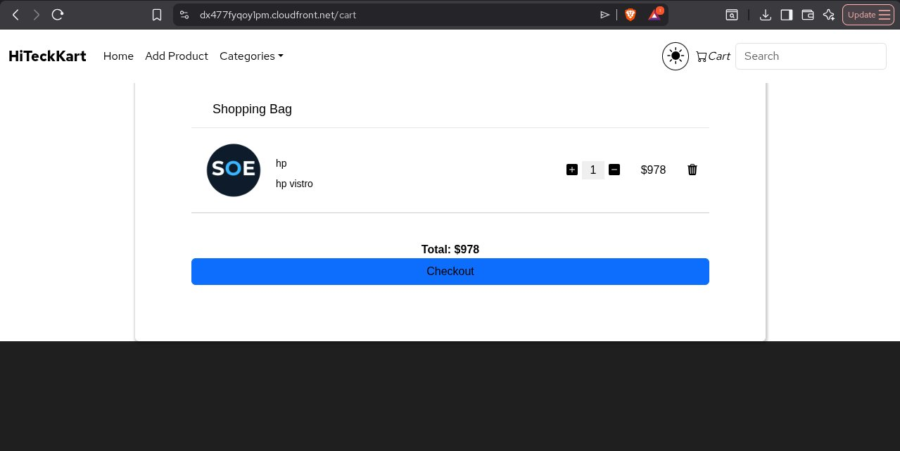 |

| Checkout | Search |
|----------|--------|
| 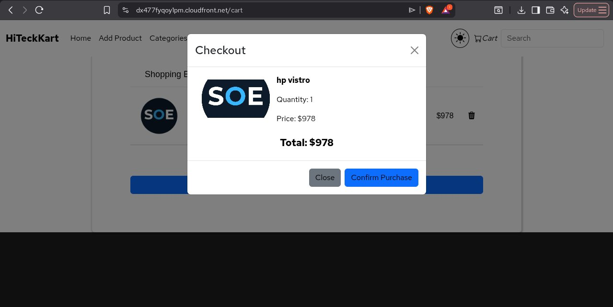 | 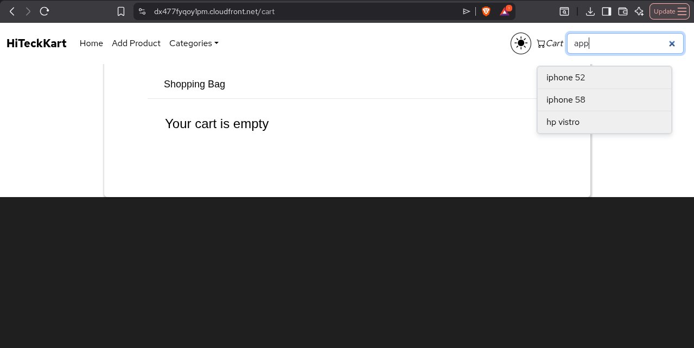 |

---

## Architecture Diagram

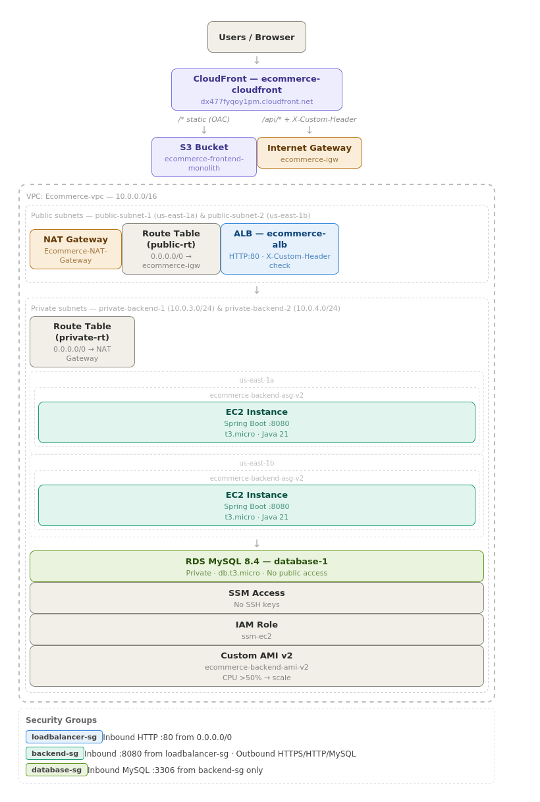

**Traffic flow:**
```
Users → CloudFront → IGW → ALB (public subnet)
                               ↓  X-Custom-Header verified
                          Target Group (ecommerce-tg-v2)
                               ↓
                    EC2 in ASG (private subnet)
                               ↓
                   RDS MySQL (private subnet, no public access)

CloudFront → S3 (/* static React files via OAC)
```

---

## Tech Stack

### Frontend

| Technology | Purpose |
|------------|---------|
| React.js | UI framework |
| Vite | Build tool |
| Bootstrap 5 | Responsive styling |
| Axios | HTTP client |
| React Router | Client-side routing |
| Context API | Cart state management |

### Backend

| Technology | Purpose |
|------------|---------|
| Spring Boot 3.3 | Application framework |
| Java 21 (Corretto) | Runtime |
| Spring Data JPA + Hibernate | ORM / database layer |
| MySQL Connector | Database driver |

### AWS Infrastructure

| Service | Resource Name | Purpose |
|---------|--------------|---------|
| CloudFront | `ecommerce-cloudfront` | CDN, HTTPS, routing |
| S3 | `ecommerce-frontend-monolith` | Static frontend hosting |
| ALB | `ecommerce-alb` | Load balancing + security |
| EC2 Auto Scaling | `ecommerce-backend-asg-v2` | Spring Boot app servers |
| RDS MySQL 8.4 | `database-1` | Managed database |
| VPC | `Ecommerce-vpc` | Network isolation |
| NAT Gateway | `Ecommerce-NAT-Gateway` | EC2 outbound internet |
| IAM Role | `ssm-ec2` | EC2 instance permissions |
| SSM Session Manager | — | Secure EC2 access, no SSH |

---

## AWS Infrastructure

### VPC & Networking

| Resource | Name | Value |
|----------|------|-------|
| VPC | `Ecommerce-vpc` | `10.0.0.0/16` |
| Public Subnet 1 | `public-subnet-1` | `10.0.1.0/24` · us-east-1a |
| Public Subnet 2 | `public-subnet-2` | `10.0.2.0/24` · us-east-1b |
| Private Subnet 1 | `private-backend-1` | `10.0.3.0/24` · us-east-1a |
| Private Subnet 2 | `private-backend-2` | `10.0.4.0/24` · us-east-1b |
| Internet Gateway | `ecommerce-igw` | Attached to VPC |
| NAT Gateway | `Ecommerce-NAT-Gateway` | In `public-subnet-1` |
| Public Route Table | `public-rt` | `0.0.0.0/0 → ecommerce-igw` |
| Private Route Table | `private-rt` | `0.0.0.0/0 → Ecommerce-NAT-Gateway` |

**Screenshots:**

| VPC | Subnets |
|-----|---------|
| 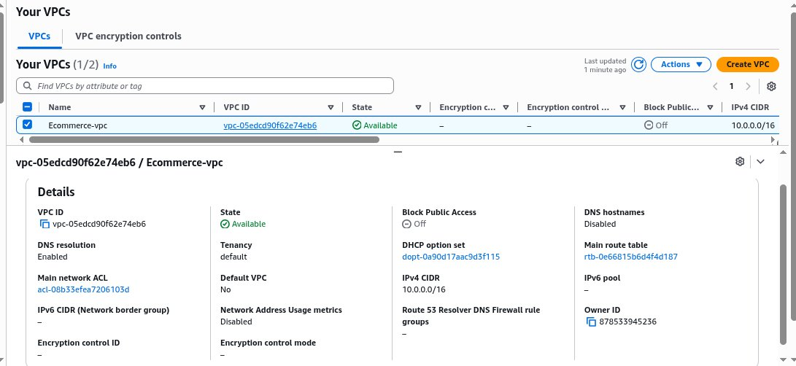 | 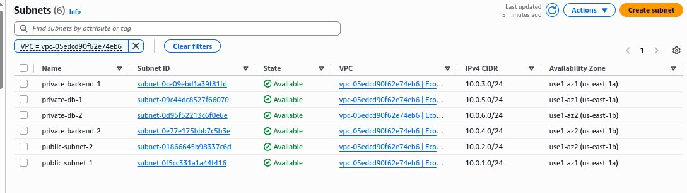 |

| Internet Gateway | NAT Gateway |
|-----------------|------------|
| 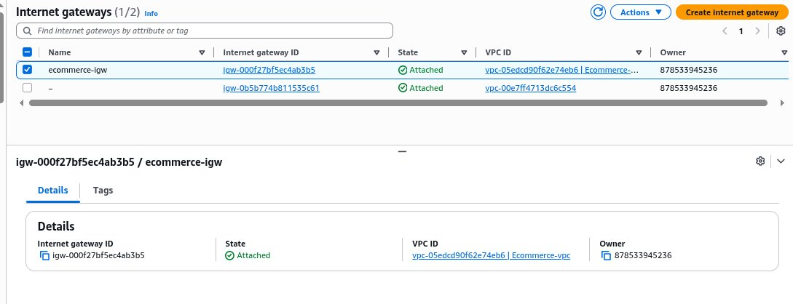 | 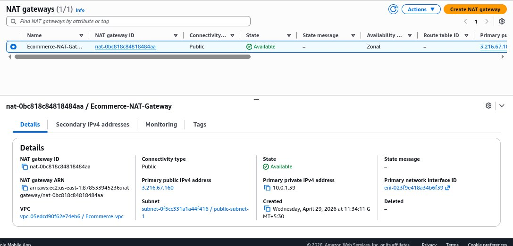 |

| Public Route Table | Private Route Table |
|-------------------|---------------------|
|  | 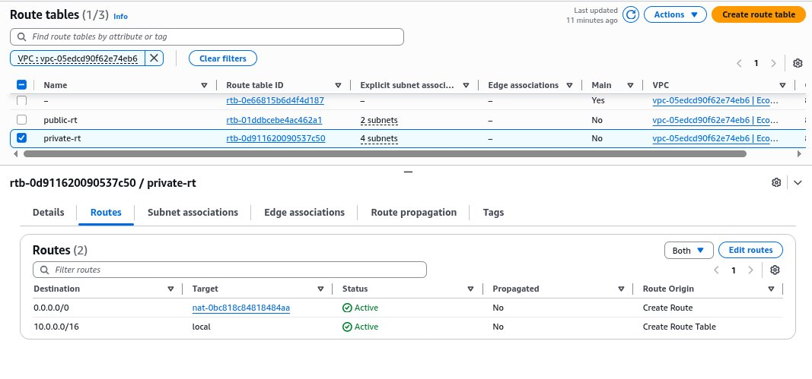 |

---

### Security Groups

| Security Group | Name | Rule |
|---------------|------|------|
| ALB | `loadbalancer-sg` | Inbound HTTP :80 from `0.0.0.0/0` |
| Backend | `backend-sg` | Inbound :8080 from `loadbalancer-sg` only |
| Backend | `backend-sg` | Outbound: All traffic, HTTPS :443, HTTP :80, MySQL :3306 → `database-sg` |
| RDS | `database-sg` | Inbound MySQL :3306 from `backend-sg` only |

**Screenshots:**

| backend-sg Inbound | backend-sg Outbound |
|-------------------|---------------------|
| 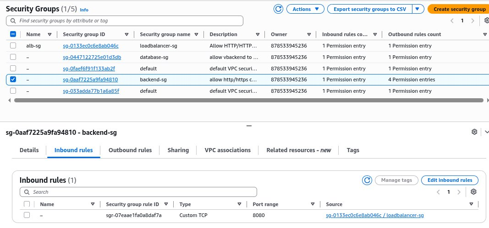 | 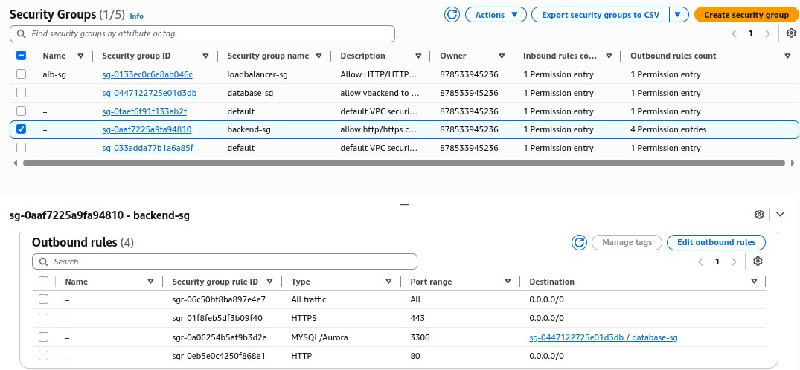 |

| loadbalancer-sg Inbound | database-sg Inbound |
|------------------------|---------------------|
| 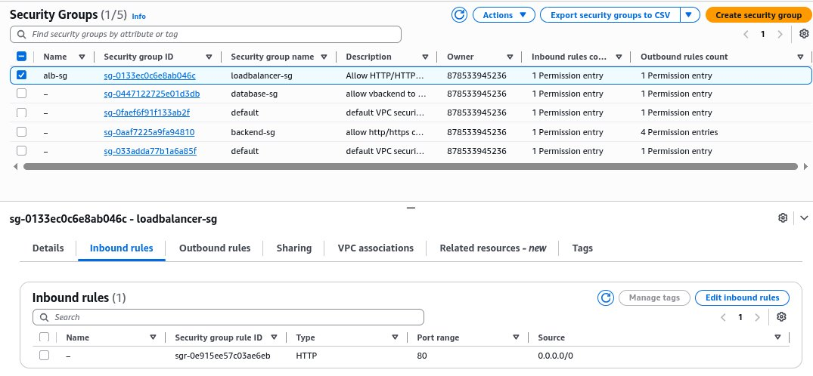 | 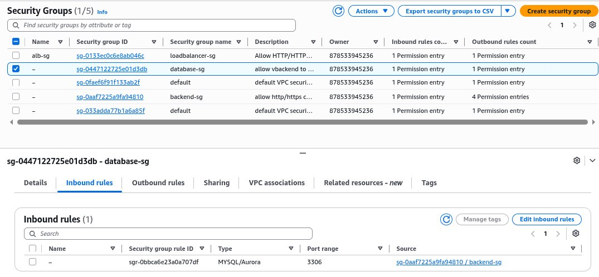 |

---

### EC2 & Auto Scaling

| Resource | Name | Detail |
|----------|------|--------|
| AMI | `ecommerce-backend-ami-v2` | Java 21 + Spring Boot pre-installed |
| Launch Template | `ecommerce-backend-lt-v2` | AMI `ami-0b61ad84fd7f101c3` · t3.micro |
| Auto Scaling Group | `ecommerce-backend-asg-v2` | Min: 1 · Max: 2 · Desired: 1 |
| Scaling Policy | `cpu-utilization` | Target tracking · CPU > 50% |
| EC2 Access | SSM Session Manager | No SSH keys, no bastion host |
| IAM Role | `ssm-ec2` | `AmazonEC2RoleforSSM` + `AmazonSSMManagedInstanceCore` |

**Screenshots:**

| EC2 Instance | Launch Template |
|-------------|----------------|
| 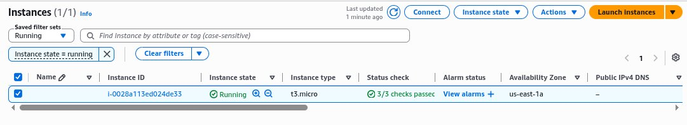 | 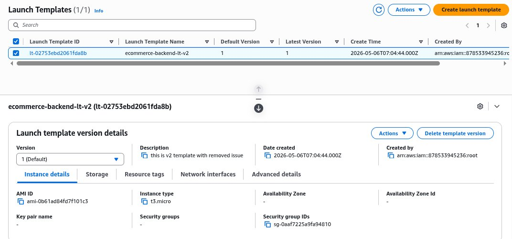 |

| ASG Details | ASG Scaling Policy |
|------------|-------------------|
| 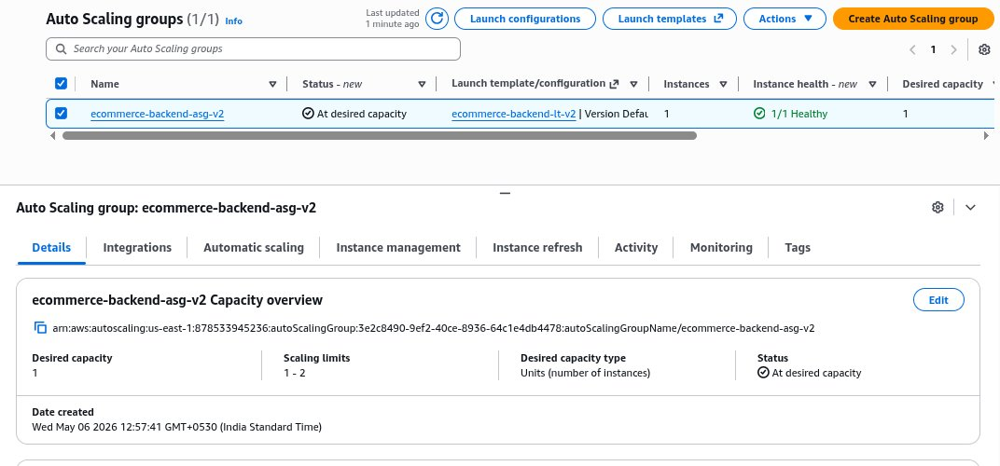 | 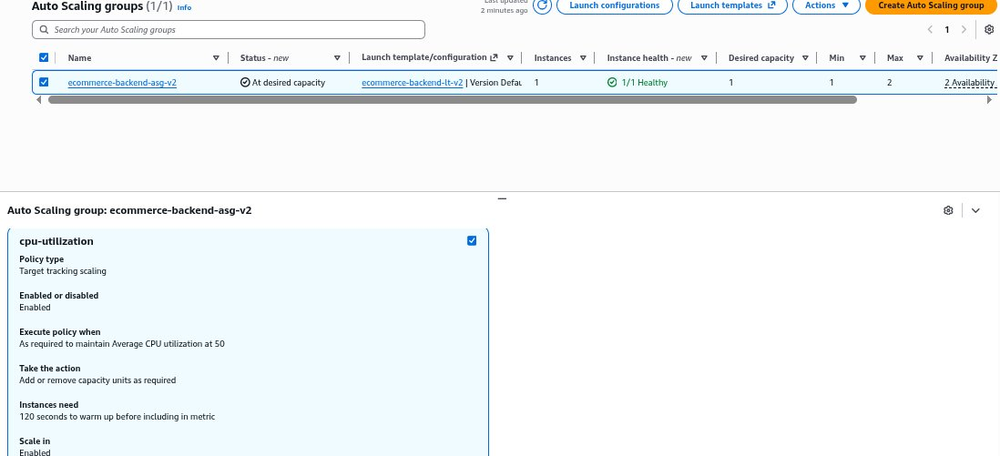 |

| Custom AMI | IAM Role |
|-----------|---------|
| 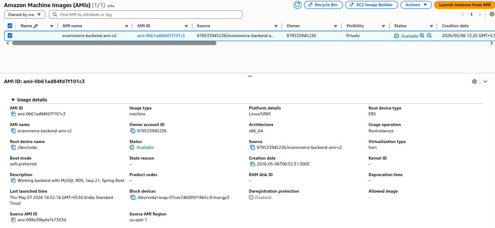 | 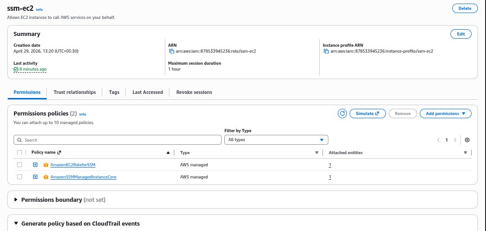 |

---

### Application Load Balancer

| Resource | Name | Detail |
|----------|------|--------|
| ALB | `ecommerce-alb` | Internet-facing · IPv4 |
| DNS | — | `ecommerce-alb-1891225866.us-east-1.elb.amazonaws.com` |
| Target Group | `ecommerce-tg-v2` | HTTP :8080 · Health check: `/api/products` |
| Listener Rule 1 | `allow-cloudfront` | `X-Custom-Header = my-secret-value-12345` → forward to TG |
| Default Rule | — | Return 403 Access Denied |

**Screenshots:**

| ALB Details | Target Group (Healthy) |
|------------|----------------------|
| 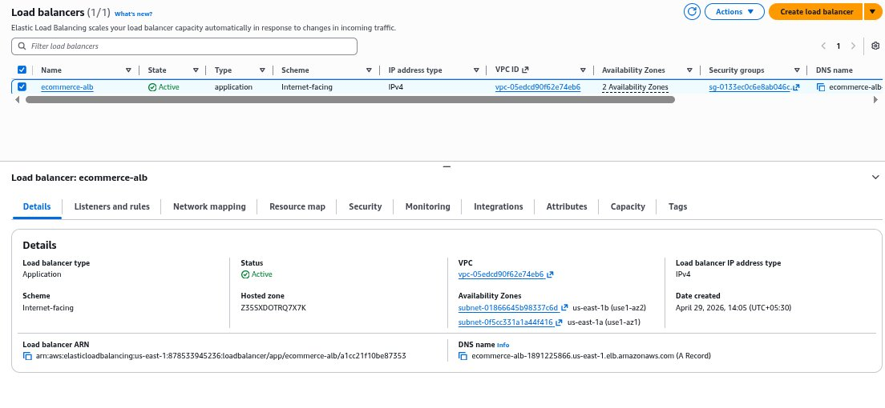 | 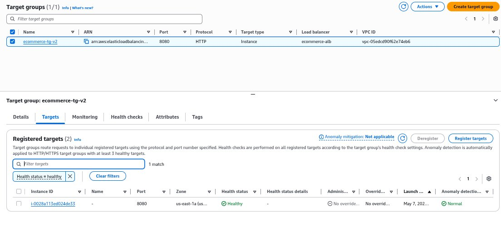 |

| Listener Rules |
|---------------|
| 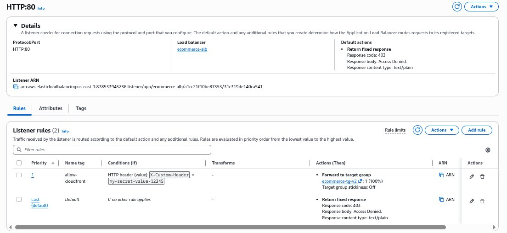 |

---

### RDS MySQL

| Resource | Detail |
|----------|--------|
| Identifier | `database-1` |
| Engine | MySQL Community 8.4.8 |
| Class | db.t3.micro · 1 GB RAM |
| DB Name | `ecommerce` |
| Endpoint | `database-1.cy76ga6a49cu.us-east-1.rds.amazonaws.com` |
| Access | No public access · private subnet only |
| Security | `database-sg` — inbound only from `backend-sg` |

**Screenshots:**

| RDS Configuration | RDS Connectivity |
|-----------------|----------------|
| 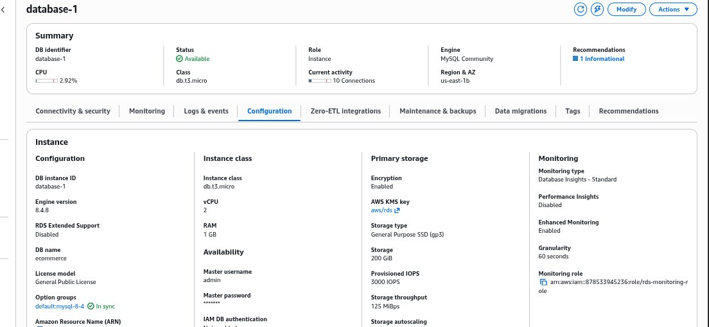 | 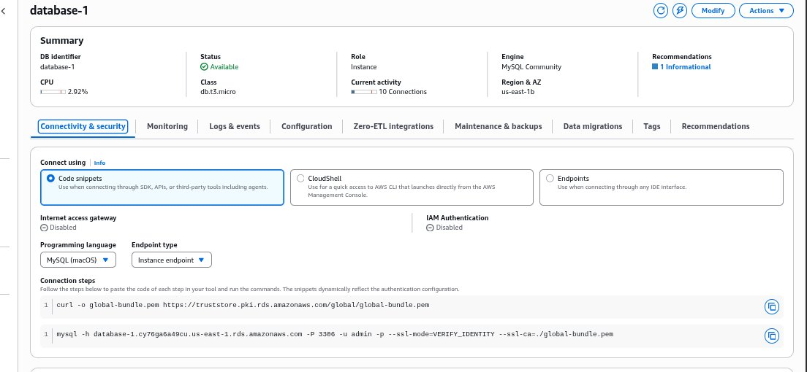 |

| RDS Security Groups |
|--------------------|
| 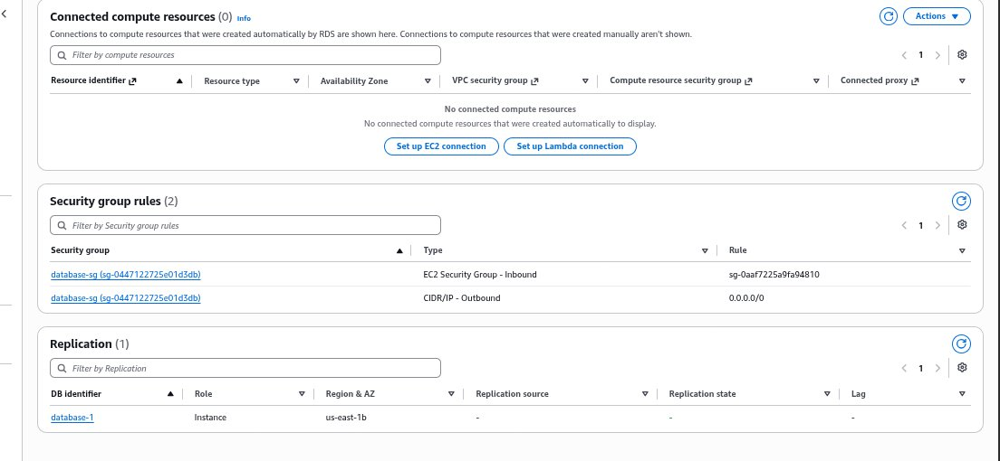 |

---

### S3 & CloudFront

| Resource | Detail |
|----------|--------|
| S3 Bucket | `ecommerce-frontend-monolith` |
| S3 Access | Block all public access: On · OAC protected |
| CloudFront | `ecommerce-cloudfront` |
| Domain | `dx477fyqoy1pm.cloudfront.net` |
| Distribution ID | `E4XO4U8UJNVMS` |
| Behavior 0 | `/api/*` → ALB · CachingDisabled |
| Behavior 1 | `Default (*)` → S3 · CachingOptimized |

**Screenshots:**

| S3 Permissions | CloudFront General |
|---------------|-------------------|
| 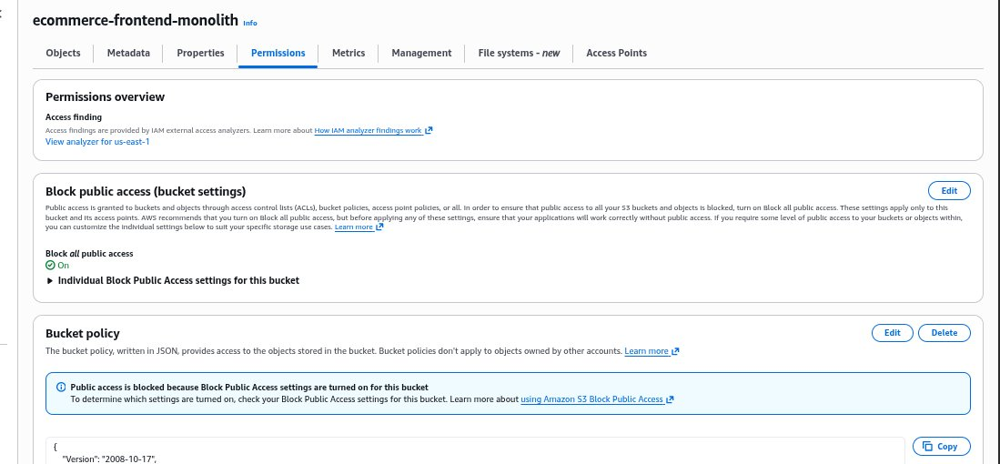 | 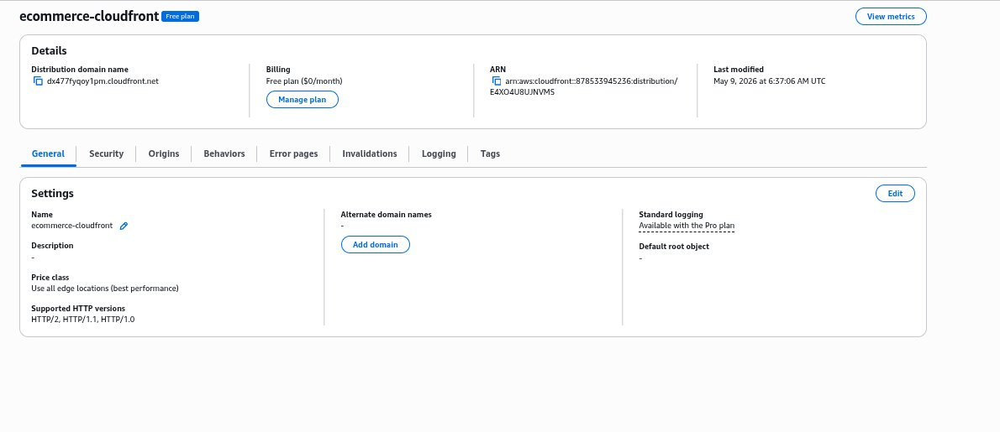 |

| CloudFront Behaviors |
|---------------------|
| 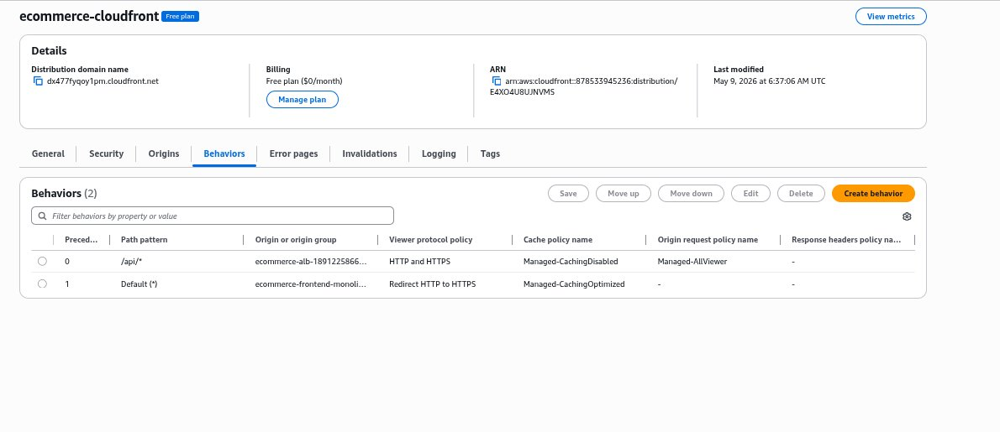 |

---

## Security Architecture

The app uses a layered security model — each layer only accepts traffic from the layer directly above it.

```
Internet
   ↓
CloudFront  (only entry point for users)
   ↓  forwards X-Custom-Header
ALB         (returns 403 if header missing — blocks direct ALB access)
   ↓  loadbalancer-sg allows :8080 from alb-sg only
EC2         (no public IP, private subnet, SSM access only)
   ↓  backend-sg allows :3306 from backend-sg only
RDS         (no public access, private subnet only)
```

| Layer | Control |
|-------|---------|
| CloudFront → ALB | `X-Custom-Header` required — ALB returns 403 without it |
| ALB → EC2 | `backend-sg` allows :8080 from `loadbalancer-sg` only |
| EC2 → RDS | `database-sg` allows :3306 from `backend-sg` only |
| S3 | Private bucket, OAC — only CloudFront can read it |
| EC2 shell access | SSM Session Manager — no SSH keys, no bastion host needed |
| EC2 outbound | NAT Gateway — EC2 has no public IP |

---

## Bugs Fixed

### Backend

| Bug | Fix |
|-----|-----|
| CORS blocked frontend requests | Added `@CrossOrigin` and `WebMvcConfigurer` CORS config |
| Images stored as Base64 caused large payloads | Changed `image_data` to `LONGBLOB`, store raw bytes |
| App crashed on startup — missing DB config | Added RDS endpoint to `application.properties` |
| `LazyInitializationException` on product fetch | Added `@Transactional` on service methods |

### Frontend

| Bug | Fix |
|-----|-----|
| Hardcoded `localhost` API URL broke production | Used Vite env variable `VITE_API_BASE_URL` |
| Image from BLOB not displaying | Converted byte array to Base64 data URL in component |
| Cart state lost on page refresh | Persisted cart to `localStorage` via Context API |
| React Router direct URL returned 404 | Added CloudFront error pages 403/404 → `/index.html` |

### Infrastructure

| Bug | Fix |
|-----|-----|
| EC2 couldn't reach RDS | Fixed `database-sg` source to `backend-sg` |
| ALB health check failing, 502 errors | Changed health check path from `/` to `/api/products` |
| EC2 no outbound internet on startup | Added NAT Gateway + private route table entry |
| Direct ALB access bypassed CloudFront | Added `X-Custom-Header` listener rule, default 403 |

---

## What I Learned

**VPC from scratch** — Building the full network layer taught me how subnets, route tables, IGW, and NAT Gateway fit together. Private subnets with NAT give EC2 outbound access without any public exposure.

**Custom header security pattern** — The `X-Custom-Header` between CloudFront and ALB ensures users can only reach the app through CloudFront. The ALB rejects all direct requests with 403.

**Custom AMI + Launch Template** — Pre-baking Java 21 and the Spring Boot JAR into a custom AMI (`ecommerce-backend-ami-v2`) dramatically reduced instance startup time vs installing dependencies in user data every launch.

**SSM Session Manager** — Accessing private EC2 instances without SSH keys or a bastion host is more secure and simpler to manage.

**CloudFront as reverse proxy** — Routing `/api/*` to ALB and `/*` to S3 from a single CloudFront distribution eliminates CORS issues entirely.

**BLOB image handling** — Storing images as `LONGBLOB` in MySQL and converting to Base64 data URLs on the frontend required careful handling at every layer.

---

## Repository Structure

```
ecommerce-aws/
├── frontend/                  # React + Vite
│   ├── src/
│   │   ├── components/
│   │   ├── context/           # Cart context (Context API)
│   │   ├── pages/
│   │   └── App.jsx
│   ├── .env.production
│   └── package.json
├── backend/                   # Spring Boot
│   ├── src/main/java/com/ecommerce/
│   │   ├── controller/
│   │   ├── service/
│   │   ├── repository/
│   │   └── model/
│   ├── src/main/resources/
│   │   └── application.properties
│   └── pom.xml
├── screenshots/
│   ├── app/                   # Application screenshots
│   └── aws/                   # AWS console screenshots
│       ├── vpc/
│       ├── security-groups/
│       ├── ec2-asg/
│       ├── alb/
│       ├── rds/
│       ├── s3-cloudfront/
│       └── iam/
├── docs/
│   └── architecture.png
└── README.md
```

---

## Running Locally

**Backend**
```bash
cd backend
export SPRING_DATASOURCE_URL=jdbc:mysql://localhost:3306/ecommerce
export SPRING_DATASOURCE_USERNAME=root
export SPRING_DATASOURCE_PASSWORD=yourpassword
mvn spring-boot:run
# http://localhost:8080
```

**Frontend**
```bash
cd frontend
echo "VITE_API_BASE_URL=http://localhost:8080" > .env.local
npm install
npm run dev
# http://localhost:5173
```

---

## Author

Built and deployed by **[Your Name]**

[GitHub](https://github.com/yourusername) · [LinkedIn](https://linkedin.com/in/yourprofile)
